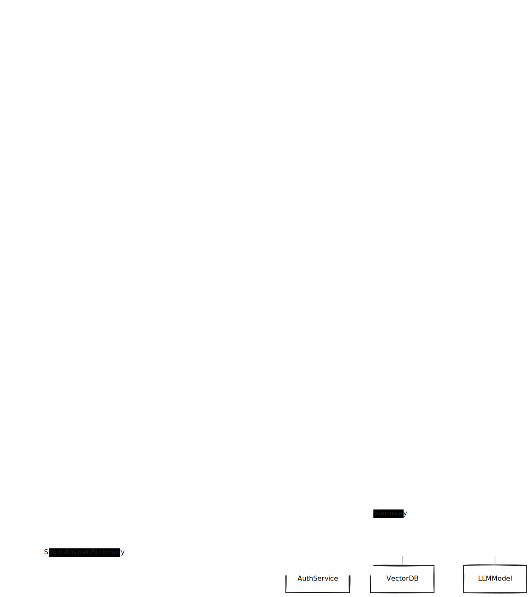

# NoterAI

NoterAI helps students learn better by enabling them to take notes using a Notion-like UI, or their voice. The platform leverages AI to summarize notes, generate quizzes from notes, answer questions based on the notes, and keep students motivated with interesting facts related to their study topics.

[[toc]]

### Prerequisites

- npm (version X.X.X)
- Flutter (version X.X.X)
- cargo (version X.X.X)

### Tech Stack

- **Backend**: NestJS
- **Mobile**: Flutter
- **Web**: Next.js
- **AI**: Rust (few functions), Python (main AI functions)

### Workflow

### Sequential Diagram

### Installation

Visit our [Installation Guide](./installation.md) to learn how to install the project on your local machine.

### Usage

Visit our [Usage Guide](./usage.md) to learn how to use the project.

### Features

- **Note-Taking**: Take notes using a Notion-like UI.
- **Summarization**: Summarize your notes with the help of AI.
- **Quizzes**: Generate quizzes from your notes to aid in studying.
- **Q&A**: Get answers to your questions based on your notes.
- **Strange Facts**: Receive interesting and motivational facts related to your studies.

### Contributing

Visit our [Contributing Guidelines](./contributing.md) to learn how to contribute to the project.

### Coding Standards

We follow industry standards, emphasizing test-driven development and clean, modular code. Please ensure your contributions adhere to these guidelines.

### License

This project is licensed under the `Custom License` to prevent commercial use. See the LICENSE file for details, in github.

### Contact

If you want to contact us, please reach out at [hyattherate2005@gmail.com](mailto:hyattherate2005@gmail.com).

### Support

If you encounter any issues, please create an issue in our GitHub repository.

### Acknowledgments

- Thanks to all the contributors who helped in developing this project.
- Special thanks to the AI community for their support and resources.

---

Enjoy learning with noterAI and enhance your study experience!

---

For more detailed documentation, please refer to our Docs (coming soon).
